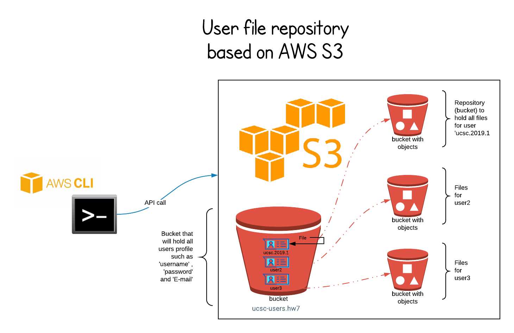
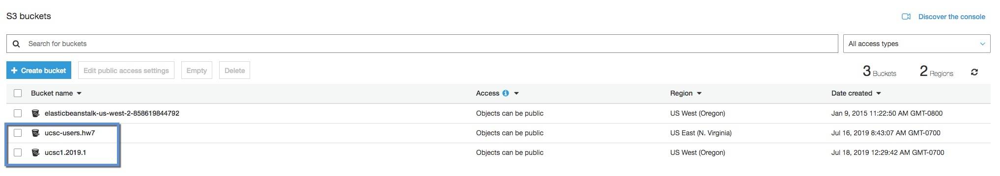
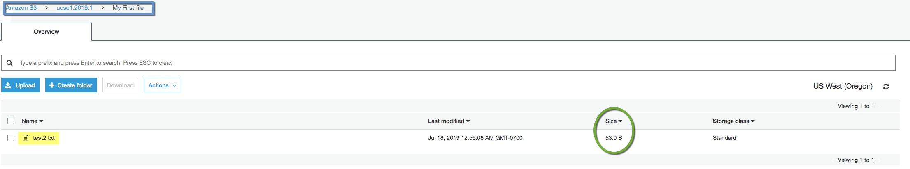
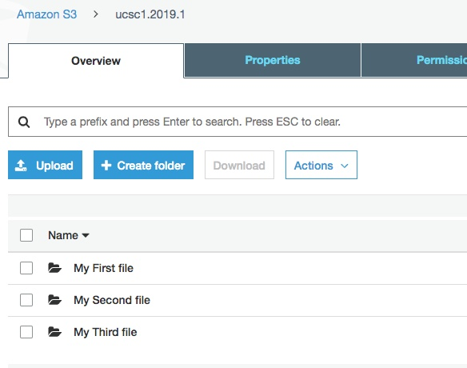
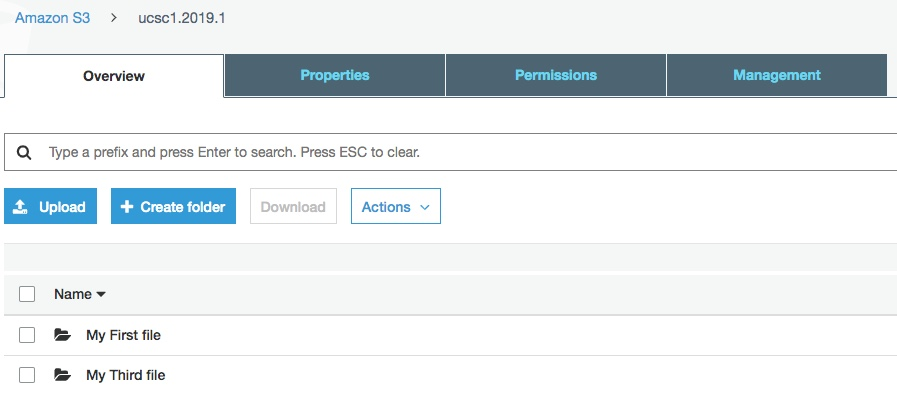

# aws-s3-w3

### Introduction 

Objective of this project is to use AWS S3 as file storage for ad-hoc users. 

Users will use command line script s3repo.sh to first create a repository for themselves (intern that is S3 bucket);part of user creation users will also prove password and E-mail address 

Once user has been create user can do few things :

1) Upload file : Upload a local file to Repository ( S3 Bucket ) while uploading they can provide one field called file-key that will can be short description of this file 

2) List files : User can get list of all file stored in Repository 

3) Download file : User can download file via giving file-key that they gave during description 

4) Delete file : User can delete uploaded file from Repository via providing file-key 

All of above commands will need to have user-name and password passed as input and it will be validated against password was provided during user creation 




### About files 

s3repo.sh : This is main driver file - this takes care of validating input ( number of parameters , options etc ) - it has no AWS S3 Api code 

function.sh : This is script that interacts with AWS S3 via using AWS S3 api installed on machine 

"test folder" : Has sample files for testings 

### Sample output 

## Help 
   
   If user does not provide any input or runs it with -h option you will see output like this 

``` BASH 
vagrant@amx-vbox:/vagrant/aws-cli/w3$ ./s3repo.sh
No parameters were passed

usage: ./s3repo.sh options

In order to run this script you need to pass one of below options

OPTIONS:
   -h               Show this message
   -createuser      Create user repository
                          ./s3repo.sh -createuser user-name password email
   -deleteuser      Delete user repository
                          ./s3repo.sh -deleteuser user-name password
   -uploadfile      Upload file to user repository
                          ./s3repo.sh -uploadfile user-name password file-key path-to-file-to-upload
   -listfiles       list users file in repository
                          ./s3repo.sh -listfiles user-name password
   -getfile         get a perticular file from users repository
                          ./s3repo.sh -getfile user-name password file-key path-to-save-file-to
   -deletefile      delete users file in repository with matching file-key
                          ./s3repo.sh -getfile user-name password file-key
```

### Create User 

    Below output shows that user ucsc1.2019.1 was created
    This means there is bucket on AWS named 'ucsc1.2019.1' and there will be also one more bucket called '' this will hold all user information ( password & e-mail address ) 
``` BASH
vagrant@amx-vbox:/vagrant/aws-cli/w3$ ./s3repo.sh -createuser ucsc1.2019.1 12345678 ucsc@uc.com

About to create user [ucsc1.2019.1] with password [12345678] and E-mail [ucsc@uc.com]

make_bucket: ucsc1.2019.1
User Created/Updated successfully
```
Image shows two buckets created 



### Upload file 

    Below output shows user ucsc1.2019.1 uploading file from folder "test folder" file name "test2.txt"
    file-key in this case is "My First file"
``` BASH 
vagrant@amx-vbox:/vagrant/aws-cli/w3$ ./s3repo.sh -uploadfile ucsc1.2019.1 12345678 "My First file" "test folder/test2.txt"
About to upload file for user [ucsc1.2019.1] with password [12345678] file key [My First file] and local file [test folder/test2.txt](53 kb)
User [ucsc1.2019.1] is authenticated successfully
2019-07-18 00:55:08         53 test2.txt
File [test folder/test2.txt] got successfully uploaded to repository [s3://ucsc1.2019.1/My First file/]
```

Image shows file uploaded to S3



## Two more files upload 

``` BASH 
vagrant@amx-vbox:/vagrant/aws-cli/w3$ ./s3repo.sh -uploadfile ucsc1.2019.1 12345678 "My Second file" "test folder/lipsum-big.txt"
About to upload file for user [ucsc1.2019.1] with password [12345678] file key [My Second file] and local file [test folder/lipsum-big.txt](6804 kb)
User [ucsc1.2019.1] is authenticated successfully
2019-07-18 01:03:03       6804 lipsum-big.txt
File [test folder/lipsum-big.txt] got successfully uploaded to repository [s3://ucsc1.2019.1/My Second file/]

vagrant@amx-vbox:/vagrant/aws-cli/w3$ ./s3repo.sh -uploadfile ucsc1.2019.1 12345678 "My Third file" "test folder/lipsum.txt"
About to upload file for user [ucsc1.2019.1] with password [12345678] file key [My Third file] and local file [test folder/lipsum.txt](3383 kb)
User [ucsc1.2019.1] is authenticated successfully
2019-07-18 01:03:24       3383 lipsum.txt
File [test folder/lipsum.txt] got successfully uploaded to repository [s3://ucsc1.2019.1/My Third file/]
```

Image shows list of files from AWS S3 console 




### List files 

``` BASH 
vagrant@amx-vbox:/vagrant/aws-cli/w3$ ./s3repo.sh -listfiles ucsc1.2019.1 12345678
About to list files by user [ucsc1.2019.1]
User [ucsc1.2019.1] is authenticated successfully
Listing files in user's repository
==================================
2019-07-18 01:00:55    6.6 KiB My First file/lipsum-big.txt
2019-07-18 01:03:03    6.6 KiB My Second file/lipsum-big.txt
2019-07-18 01:03:24    3.3 KiB My Third file/lipsum.txt
```

### Download file 
    
    Below output shows that first we deleted local file "lipsum-big.txt" from folder "test folder" so we can download it back 

    Second command shows file getting downloaded 

    Third shows file is now present in file system 

``` BASH

vagrant@amx-vbox:/vagrant/aws-cli/w3$ rm -rf "test folder/lipsum-big.txt"

vagrant@amx-vbox:/vagrant/aws-cli/w3$ ./s3repo.sh -getfile ucsc1.2019.1 12345678 "My Second file" "test folder"
About to download file by user [ucsc1.2019.1] , matching file-key My Second file to destination test folder
User [ucsc1.2019.1] is authenticated successfully
download: s3://ucsc1.2019.1/My Second file/lipsum-big.txt to test folder/lipsum-big.txt
File with key [My Second file] got successfully downloaded to local directory [test folder]

vagrant@amx-vbox:/vagrant/aws-cli/w3$ ls -la "test folder/lipsum-big.txt"
-rwxrwxr-- 1 vagrant vagrant 6804 Jul 18 01:03 test folder/lipsum-big.txt


```

### Delete file from Repository 

``` BASH 
vagrant@amx-vbox:/vagrant/aws-cli/w3$ ./s3repo.sh -deletefile ucsc1.2019.1 12345678 "My Second file"
About to delete file by user [ucsc1.2019.1], matching file-key My Second file
User [ucsc1.2019.1] is authenticated successfully
delete: s3://ucsc1.2019.1/My Second file/lipsum-big.txt
File with key [My Second file] got successfully deleted from user's [ucsc1.2019.1] repository
```

Image shows list of file gone from AWS S3 console 



<details>
  <summary>Click to expand</summary>
  whatever
</details>
