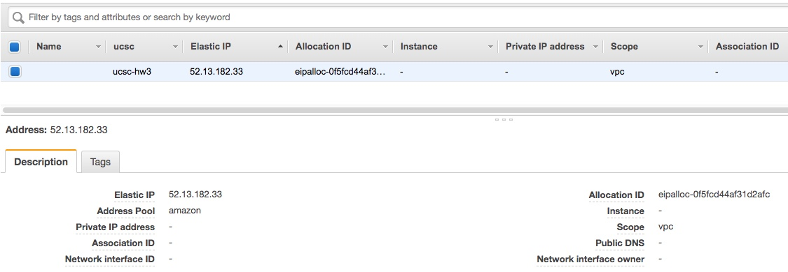
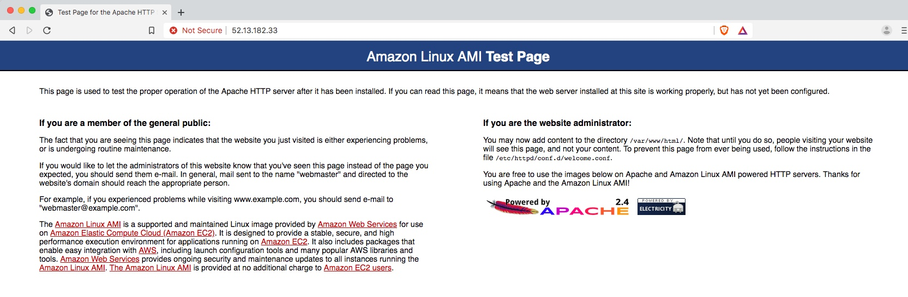
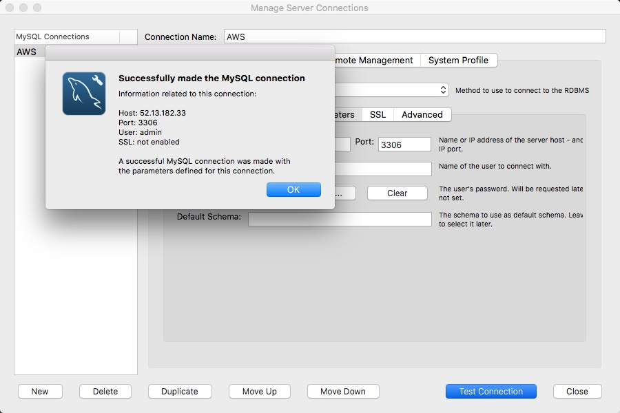
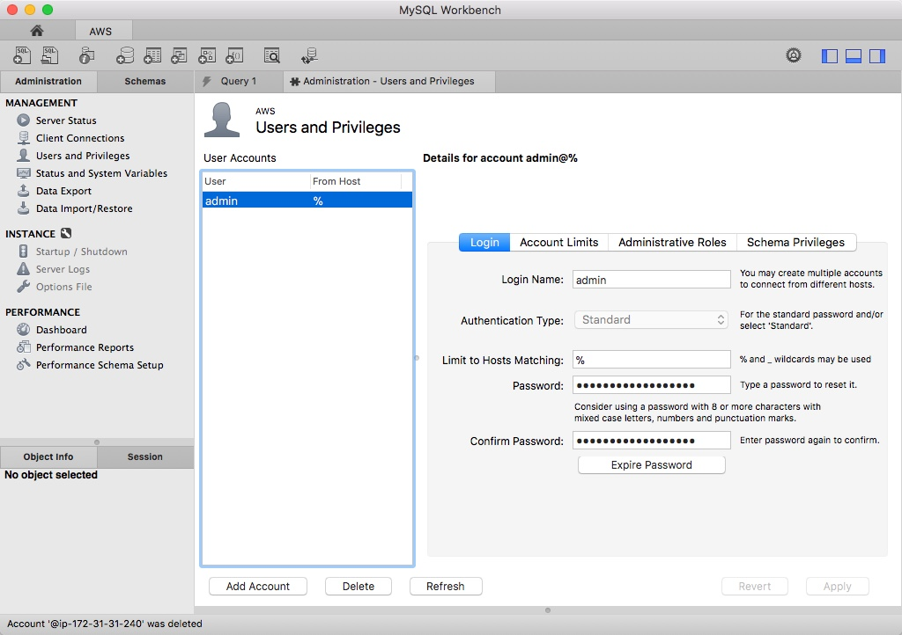
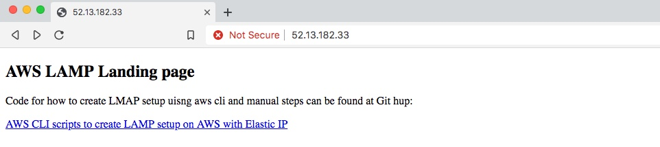

## Expermenting with AWS CLI and SSH to create LAMP base setup 

<details>
  <summary>Full Requirement</summary>

Using the AWS Command lines tools from a bash shell, this assignment will ask you to create a set of bash shell scripts to manage an EC2 instance and create a classic LAMP stack (webserver + database).  All the steps below must use "aws ec2 ..." CLI script commands.

 

01) EC2 Creation:

Use an Amazon Linux AMI, t2.micro instance.

Make sure that it has an Elastic IP address (i.e. a public IP address) and an SSH key pair.

Add a tag called 'Name' and give it a value "LAMP server".

Note the private IP network address of your VPC, you will need this later to allow MySQL to communicate with your web server.

 

02) Configure EC2 Security Group:

Configure the security group to only allow your laptop to have access to the new instance via the Internet.  You can use https://icanhazip.com/ (Links to an external site.) to find out your laptop's public IP address.

You will also need rules to allow the MySQL database to communicate with the web server.

4 Security Group Rules: 

Note: 73.70.211.212 is a placeholder value for your actual laptop public IP address.

          10.0.0.0/8 is a placeholder value for your actual VPC private IP network range.

           0.0.0.0/0 allows the whole Internet to access your web server

Type     Protocol      Port Range       Source

SSH      TCP            22                      73.70.211.212/8

MySQL  TCP            3306                  10.0.0.0/0

HTTP     TCP            80                      0.0.0.0/0

HTTPS   TCP            443                    0.0.0.0/0

 

03) Connect to your new instance:

SSH connect into your new instance using your SSH key.

Note the account name will be "ec2-user".

 

04) Configure Linux Groups and File Permissions:

Run: sudo yum update
Installs and updates to the Amazon Linux Dependencies.


Run: sudo yum install -y httpd24 php70 mysql56-server php70-mysqlnd
Installs Apache 2.4, MySQL Server 5.6, PHP 7.0, and the mysqld-php service.

Run: sudo service http start && sudo chkconfig httpd on
Start Apache and check for errors.

Run: sudo groupadd www
Creates the group www.

Run: sudo usermod -a -G www ec2-user
Sets the file structure for group www and the user.

Log out and log back into the SSH client.

The next 4 commands are here to setup the correct file structure and permissions so that Apache can run all of the files placed in the root directory.

Run: sudo chown -R root:www /var/ww

Run: sudo chmod 2775 /var/www

Run: find /var/www -type d -exec sudo chmod 2775 {} \;

Run: find /var/www -type f -exec sudo chmod 0664 {} \;

Run: sudo nano /etc/php.ini

Press CTRL + W and type filesize and hit enter.
Replace 2M with 8M on the next line.
Press CTRL + X to save the file.
Hit y to confirm.
And hit enter to confirm again.

Run: sudo chkconfig httpd on
Check for errors in Apache’s configuration.

 

05) Check out your new web server:

Enter the the Elastic IP into your browser and see your Amazon Linux AMI Test page.

 

06) Configure MySQL install and Create a Root Account:

Run: mysql -u root -p
Just hit enter for the password since we haven’t configured one yet.


Go into your browser, and type “icanhazip.com” and find out your public IP address so that we can use it in our admin account for an added layer of security.

Create the admin user with full permissions:
    Run: CREATE USER ‘admin’@’___YOUR_IP___’ IDENTIFIED BY ‘___YOUR_PASSWORD___’;
    Run: GRANT ALL ON *.* TO ‘admin’@’___YOUR_IP___’;
    Run: GRANT GRANT OPTION ON *.* TO ‘admin’@’___YOUR_IP___’;
    Now, open your MySQL workbench.
        Click add connection. (The plus next to MySQL connections)
        Enter the Elastic IP as the host name.
        Enter ‘admin’ as the user.
        And click “Store in Vault” and enter the password you just assigned to the admin user.
        Test your connection, if successful, continue to the next command.
    Run: FLUSH PRIVILEGES;
        Only run this command AFTER confirming you can login with the new root account.
    Run: sudo chkconfig mysqld on
        Check for errors in the MySQL service configuration
    Now head back to the MySQL workbench, and click on “Users” in the Management tab on the left hand side of the screen.
    Delete all other users other than the admin account we created to ensure the best security practices for your new database configuration.

 

07) Summary:

If you made it all the way through, congratulations! You just made your first LAMP Stack. You successfully created an instance with Amazon Linux, installed a MySQL Server, PHP and Apache HTTP Software, as well as configured a root MySQL account.

You can place your web-app files or raw HTML in the /var/www/html/ folder in your instance’s directory to view them like any other website. Just enter the Elastic IP in your browser and navigate to the folders or file you uploaded.

 
</details>

## Top-level step 

1. Create a Security Group
2. Create t2.mocro AWS Linux based instance 
3. Associate Elastic IP to the instance 
4. Copy provision script to new AWS Linux machine/instance 
5. Log-into machine and run provisioning script 
6. Check to see Apache is running 
7. Log-into MySQL and create Admin User 
8. Check connection via MySQL workbench
9. Copy simple HTML page to Apache base to check it's running 

We already have Elastic IP as shown below that we will use to access linux machine 




### Create a Security Group


``` BASH

aws ec2 delete-security-group --group-name EC2_UCSC_SecurityGroup
aws ec2 create-security-group --group-name EC2_UCSC_SecurityGroup --description "Security (for UCSC Cource) Group for EC2 instances to allow port 22,3306,80,443"
aws ec2 authorize-security-group-ingress --group-name EC2_UCSC_SecurityGroup --protocol tcp --port 22 --cidr 160.101.0.0/24
aws ec2 authorize-security-group-ingress --group-name EC2_UCSC_SecurityGroup --protocol tcp --port 22 --cidr 75.4.202.0/24
aws ec2 authorize-security-group-ingress --group-name EC2_UCSC_SecurityGroup --protocol tcp --port 3306 --cidr 160.101.0.0/24
aws ec2 authorize-security-group-ingress --group-name EC2_UCSC_SecurityGroup --protocol tcp --port 3306 --cidr 75.4.202.0/24
aws ec2 authorize-security-group-ingress --group-name EC2_UCSC_SecurityGroup --protocol tcp --port 80 --cidr 0.0.0.0/0
aws ec2 authorize-security-group-ingress --group-name EC2_UCSC_SecurityGroup --protocol tcp --port 443 --cidr 0.0.0.0/0
aws ec2 describe-security-groups --group-names EC2_UCSC_SecurityGroup

```
-- Output 

```
vagrant@amx-vbox:/vagrant/aws-cli/w4$ aws ec2 delete-security-group --group-name EC2_UCSC_SecurityGroup
urityGroupvagrant@amx-vbox:/vagrant/aws-cli/w4$ aws ec2 create-security-group --group-name EC2_UCSC_SecurityGroup --description "Security (for UCSC Cource) Group for EC2 instances to allo3306,80,443"
{
    "GroupId": "sg-00550ca0e2b88f515"
}
vagrant@amx-vbox:/vagrant/aws-cli/w4$ aws ec2 authorize-security-group-ingress --group-name EC2_UCSC_SecurityGroup --protocol tcp --port 22 --cidr 160.101.0.0/24
vagrant@amx-vbox:/vagrant/aws-cli/w4$ aws ec2 authorize-security-group-ingress --group-name EC2_UCSC_SecurityGroup --protocol tcp --port 22 --cidr 75.4.202.0/24
vagrant@amx-vbox:/vagrant/aws-cli/w4$ aws ec2 authorize-security-group-ingress --group-name EC2_UCSC_SecurityGroup --protocol tcp --port 3306 --cidr 160.101.0.0/24
vagrant@amx-vbox:/vagrant/aws-cli/w4$ aws ec2 authorize-security-group-ingress --group-name EC2_UCSC_SecurityGroup --protocol tcp --port 3306 --cidr 75.4.202.0/24
vagrant@amx-vbox:/vagrant/aws-cli/w4$ aws ec2 authorize-security-group-ingress --group-name EC2_UCSC_SecurityGroup --protocol tcp --port 80 --cidr 0.0.0.0/0
vagrant@amx-vbox:/vagrant/aws-cli/w4$ aws ec2 authorize-security-group-ingress --group-name EC2_UCSC_SecurityGroup --protocol tcp --port 443 --cidr 0.0.0.0/0
vagrant@amx-vbox:/vagrant/aws-cli/w4$ aws ec2 describe-security-groups --group-names EC2_UCSC_SecurityGroup
{
    "SecurityGroups": [
        {
            "IpPermissionsEgress": [
                {
                    "Ipv6Ranges": [],
                    "PrefixListIds": [],
                    "IpProtocol": "-1",
                    "IpRanges": [
                        {
                            "CidrIp": "0.0.0.0/0"
                        }
                    ],
                    "UserIdGroupPairs": []
                }
            ],
            "OwnerId": "858619844792",
            "GroupName": "EC2_UCSC_SecurityGroup",
            "Description": "Security (for UCSC Cource) Group for EC2 instances to allow port 22,3306,80,443",
            "IpPermissions": [
                {
                    "UserIdGroupPairs": [],
                    "IpProtocol": "tcp",
                    "IpRanges": [
                        {
                            "CidrIp": "0.0.0.0/0"
                        }
                    ],
                    "Ipv6Ranges": [],
                    "FromPort": 80,
                    "PrefixListIds": [],
                    "ToPort": 80
                },
                {
                    "UserIdGroupPairs": [],
                    "IpProtocol": "tcp",
                    "IpRanges": [
                        {
                            "CidrIp": "160.101.0.0/24"
                        },
                        {
                            "CidrIp": "75.4.202.0/24"
                        }
                    ],
                    "Ipv6Ranges": [],
                    "FromPort": 22,
                    "PrefixListIds": [],
                    "ToPort": 22
                },
                {
                    "UserIdGroupPairs": [],
                    "IpProtocol": "tcp",
                    "IpRanges": [
                        {
                            "CidrIp": "160.101.0.0/24"
                        },
                        {
                            "CidrIp": "75.4.202.0/24"
                        }
                    ],
                    "Ipv6Ranges": [],
                    "FromPort": 3306,
                    "PrefixListIds": [],
                    "ToPort": 3306
                },
                {
                    "UserIdGroupPairs": [],
                    "IpProtocol": "tcp",
                    "IpRanges": [
                        {
                            "CidrIp": "0.0.0.0/0"
                        }
                    ],
                    "Ipv6Ranges": [],
                    "FromPort": 443,
                    "PrefixListIds": [],
                    "ToPort": 443
                }
            ],
            "GroupId": "sg-00550ca0e2b88f515",
            "VpcId": "vpc-8448efe1"
        }
    ]
}
```
-- Image shwoing Seurity Group 


2. Create t2.mocro AWS Linux based instance 

We start the instance and then wait for it to come up 

```
vagrant@amx-vbox:/vagrant/aws-cli/w4$ aws ec2 run-instances   --image-id ami-0f2176987ee50226e --key-name pshah2019v2 --security-groups EC2_UCSC_SecurityGroup --instance-type t2.micro --placement \
>  AvailabilityZone=us-west-2b --block-device-mappings DeviceName=/dev/sdh,Ebs={VolumeSize=100} --count 1 | tee output.json && export INSTANCE_ID=$(cat output.json \
>   | jq .Instances[0].InstanceId) && export INSTANCE_ID=$(echo "$INSTANCE_ID" | tr -d '"') &&echo "";echo "##############################################"; \
>   echo "Instance ID of machine is $INSTANCE_ID"
{
    "Instances": [
        {
            "ImageId": "ami-0f2176987ee50226e",
            "PrivateIpAddress": "172.31.26.136",
            "VirtualizationType": "hvm",
            "AmiLaunchIndex": 0,
            "LaunchTime": "2019-07-22T20:14:26.000Z",
            "KeyName": "pshah2019v2",
            "SubnetId": "subnet-4a97493d",
            "InstanceType": "t2.micro",
            "ProductCodes": [],
            "StateReason": {
                "Message": "pending",
                "Code": "pending"
            },
            "Hypervisor": "xen",
            "CpuOptions": {
                "CoreCount": 1,
                "ThreadsPerCore": 1
            },
            "BlockDeviceMappings": [],
            "SecurityGroups": [
                {
                    "GroupName": "EC2_UCSC_SecurityGroup",
                    "GroupId": "sg-00703545ef54645e8"
                }
            ],
            "Architecture": "x86_64",
            "NetworkInterfaces": [
                {
                    "Description": "",
                    "MacAddress": "06:1a:11:dd:9e:e4",
                    "Status": "in-use",
                    "PrivateIpAddress": "172.31.26.136",
                    "PrivateDnsName": "ip-172-31-26-136.us-west-2.compute.internal",
                    "PrivateIpAddresses": [
                        {
                            "PrivateIpAddress": "172.31.26.136",
                            "Primary": true,
                            "PrivateDnsName": "ip-172-31-26-136.us-west-2.compute.internal"
                        }
                    ],
                    "Attachment": {
                        "DeleteOnTermination": true,
                        "Status": "attaching",
                        "AttachmentId": "eni-attach-056dea711b0c2cbd8",
                        "DeviceIndex": 0,
                        "AttachTime": "2019-07-22T20:14:26.000Z"
                    },
                    "OwnerId": "858619844792",
                    "Groups": [
                        {
                            "GroupName": "EC2_UCSC_SecurityGroup",
                            "GroupId": "sg-00703545ef54645e8"
                        }
                    ],
                    "SubnetId": "subnet-4a97493d",
                    "SourceDestCheck": true,
                    "InterfaceType": "interface",
                    "Ipv6Addresses": [],
                    "VpcId": "vpc-8448efe1",
                    "NetworkInterfaceId": "eni-0b44f7712168fc8ba"
                }
            ],
            "InstanceId": "i-008cfe3ff329b8fe1",
            "PrivateDnsName": "ip-172-31-26-136.us-west-2.compute.internal",
            "EbsOptimized": false,
            "RootDeviceName": "/dev/xvda",
            "State": {
                "Name": "pending",
                "Code": 0
            },
            "Placement": {
                "GroupName": "",
                "AvailabilityZone": "us-west-2b",
                "Tenancy": "default"
            },
            "SourceDestCheck": true,
            "StateTransitionReason": "",
            "ClientToken": "",
            "RootDeviceType": "ebs",
            "PublicDnsName": "",
            "VpcId": "vpc-8448efe1",
            "Monitoring": {
                "State": "disabled"
            },
            "CapacityReservationSpecification": {
                "CapacityReservationPreference": "open"
            }
        }
    ],
    "OwnerId": "858619844792",
    "Groups": [],
    "ReservationId": "r-0cd3a24f5472d8521"
}

##############################################
Instance ID of machine is i-008cfe3ff329b8fe1

vagrant@amx-vbox:/vagrant/aws-cli/w4$ while true
>  do
>  STATE=$(aws ec2 describe-instance-status --instance-ids $INSTANCE_ID | jq .InstanceStatuses[0].SystemStatus.Details[0].Status)
>  export STATE=$(echo "$STATE" | tr -d '"')
>
>  echo "Current state instance is $STATE"
>
>  if [ $STATE == "initializing" ]; then
>  echo "It looks like machine is not up will check again in 10 seconds"
>  sleep 10
>  else
>  echo "It looks like machien is up"
>  break
>  fi
> done
Current state instance is initializing
It looks like machine is not up will check again in 10 seconds
Current state instance is initializing
It looks like machine is not up will check again in 10 seconds
Current state instance is initializing
It looks like machine is not up will check again in 10 seconds
Current state instance is initializing
It looks like machine is not up will check again in 10 seconds
Current state instance is initializing
It looks like machine is not up will check again in 10 seconds
Current state instance is initializing
It looks like machine is not up will check again in 10 seconds
Current state instance is initializing
It looks like machine is not up will check again in 10 seconds
Current state instance is initializing
It looks like machine is not up will check again in 10 seconds
Current state instance is initializing
It looks like machine is not up will check again in 10 seconds
Current state instance is initializing
It looks like machine is not up will check again in 10 seconds
Current state instance is initializing
It looks like machine is not up will check again in 10 seconds
Current state instance is initializing
It looks like machine is not up will check again in 10 seconds
Current state instance is passed
It looks like machien is up
```


### Associate Elastic IP to the instance

Once the machine comes up we associate Elastic IP to it 

Info about Elastic IP 
``` 
vagrant@amx-vbox:/vagrant/aws-cli/w4$ export ELASIC_IP_ALLOCATION_ID=$(aws ec2 describe-addresses --filters="Name=tag-key,Values=ucsc" | jq .Addresses[0].AllocationId
> ) && export ELASIC_IP_ALLOCATION_ID=$(echo "$ELASIC_IP_ALLOCATION_ID" | tr -d '"') && echo "##########################################"; echo "Elasic IP's Allocation ID is $ELASIC_IP_ALLOCATION_ID"
##########################################
Elasic IP's Allocation ID is eipalloc-0f5fcd44af31d2afc


vagrant@amx-vbox:/vagrant/aws-cli/w4$
vagrant@amx-vbox:/vagrant/aws-cli/w4$ export ELASIC_IP=$(aws ec2 describe-addresses --filters="Name=tag-key,Values=ucsc" | jq .Addresses[0].PublicIp
> ) && export ELASIC_IP=$(echo "$ELASIC_IP" | tr -d '"') && echo "##########################################"; echo "Elasic IP's Allocation ID is $ELASIC_IP"
##########################################
Elasic IP's Allocation ID is 52.13.182.33
```

Add IP to instance 

```
vagrant@amx-vbox:/vagrant/aws-cli/w4$ aws ec2 associate-address --instance-id $INSTANCE_ID --allocation-id $ELASIC_IP_ALLOCATION_ID
{
    "AssociationId": "eipassoc-0ab5bbdee663b41ae"
}
```


### Copy provision script to new AWS Linux machine/instance 

We have copy of provisioning script - we update the host-name in it with Elastic IP address and then SCP to remote machine 

```
vagrant@amx-vbox:/vagrant/aws-cli/w4$ cp -rf /vagrant/aws-cli/w4/setup.sh /vagrant/aws-cli/w4/setup_.sh
vagrant@amx-vbox:/vagrant/aws-cli/w4$
vagrant@amx-vbox:/vagrant/aws-cli/w4$ sed -i "s/FQN_NAME/$ELASIC_IP/g" /vagrant/aws-cli/w4/setup_.sh
vagrant@amx-vbox:/vagrant/aws-cli/w4$
vagrant@amx-vbox:/vagrant/aws-cli/w4$ cat /vagrant/aws-cli/w4/setup_.sh | grep FQN_HOST_NAME
export FQN_HOST_NAME=52.13.182.33
echo "Working on machine $FQN_HOST_NAME"
vagrant@amx-vbox:/vagrant/aws-cli/w4$
vagrant@amx-vbox:/vagrant/aws-cli/w4$
vagrant@amx-vbox:/vagrant/aws-cli/w4$
vagrant@amx-vbox:/vagrant/aws-cli/w4$ scp -i /home/vagrant/pshah2019v2.pem -o UserKnownHostsFile=/dev/null -o StrictHostKeyChecking=no /vagrant/aws-cli/w4/setup_.sh ec2-user@$ELASIC_IP:~/Warning: Permanently added '52.13.182.33' (ECDSA) to the list of known hosts.
setup_.sh                                                                                                                                                100%  682     0.7KB/s   00:00
vagrant@amx-vbox:/vagrant/aws-cli/w4$
```

### Log-into machine and run provisioning script 

Provisioning script looks like this 

``` BASH
#!/bin/bash

export FQN_HOST_NAME=FQN_NAME

echo "#########################################"
echo "Working on machine $FQN_HOST_NAME"
echo "#########################################"

sudo yum update -y

sudo yum install -y httpd24 php70 mysql56-server php70-mysqlnd

sudo service httpd start && sudo chkconfig httpd on

sudo groupadd www

sudo usermod -a -G www ec2-user

sudo chown -R root:www /var/www

sudo chmod 2775 /var/www

find /var/www -type d -exec sudo chmod 2775 {} \;

find /var/www -type f -exec sudo chmod 0664 {} \;

sudo sed -i 's\2M\4M\' /etc/php.ini

cat /etc/php.ini | grep 4M

sudo chkconfig httpd on

sudo service mysqld start && sudo chkconfig mysqld on
```

Output of Provisioning ( first we log-in and then run script manually )

```
vagrant@amx-vbox:/vagrant/aws-cli/w4$ ssh -i /home/vagrant/pshah2019v2.pem  -o UserKnownHostsFile=/dev/null -o StrictHostKeyChecking=no ec2-user@$ELASIC_IP
Warning: Permanently added '52.13.182.33' (ECDSA) to the list of known hosts.

       __|  __|_  )
       _|  (     /   Amazon Linux AMI
      ___|\___|___|

https://aws.amazon.com/amazon-linux-ami/2018.03-release-notes/
3 package(s) needed for security, out of 5 available
Run "sudo yum update" to apply all updates.
[ec2-user@ip-172-31-26-136 ~]$ cd ~
[ec2-user@ip-172-31-26-136 ~]$ ./setup_.sh
#########################################
Working on machine 52.13.182.33
#########################################
Loaded plugins: priorities, update-motd, upgrade-helper
amzn-main                                                                                                                                                           | 2.1 kB  00:00:00
amzn-updates                                                                                                                                                        | 2.5 kB  00:00:00
Resolving Dependencies
--> Running transaction check
---> Package kernel.x86_64 0:4.14.128-87.105.amzn1 will be installed
---> Package kernel-tools.x86_64 0:4.14.123-86.109.amzn1 will be updated
---> Package kernel-tools.x86_64 0:4.14.128-87.105.amzn1 will be an update
---> Package python27.x86_64 0:2.7.16-1.125.amzn1 will be updated
---> Package python27.x86_64 0:2.7.16-1.127.amzn1 will be an update
---> Package python27-devel.x86_64 0:2.7.16-1.125.amzn1 will be updated
---> Package python27-devel.x86_64 0:2.7.16-1.127.amzn1 will be an update
---> Package python27-libs.x86_64 0:2.7.16-1.125.amzn1 will be updated
---> Package python27-libs.x86_64 0:2.7.16-1.127.amzn1 will be an update
--> Finished Dependency Resolution

Dependencies Resolved

===========================================================================================================================================================================================
 Package                                      Arch                                 Version                                                Repository                                  Size
===========================================================================================================================================================================================
Installing:
 kernel                                       x86_64                               4.14.128-87.105.amzn1                                  amzn-updates                                22 M
Updating:
 kernel-tools                                 x86_64                               4.14.128-87.105.amzn1                                  amzn-updates                               131 k
 python27                                     x86_64                               2.7.16-1.127.amzn1                                     amzn-updates                               103 k
 python27-devel                               x86_64                               2.7.16-1.127.amzn1                                     amzn-updates                               525 k
 python27-libs                                x86_64                               2.7.16-1.127.amzn1                                     amzn-updates                               6.8 M

Transaction Summary
===========================================================================================================================================================================================
Install  1 Package
Upgrade  4 Packages

Total download size: 30 M
Downloading packages:
(1/5): kernel-tools-4.14.128-87.105.amzn1.x86_64.rpm                                                                                                                | 131 kB  00:00:00
(2/5): python27-2.7.16-1.127.amzn1.x86_64.rpm                                                                                                                       | 103 kB  00:00:00
(3/5): python27-devel-2.7.16-1.127.amzn1.x86_64.rpm                                                                                                                 | 525 kB  00:00:00
(4/5): python27-libs-2.7.16-1.127.amzn1.x86_64.rpm                                                                                                                  | 6.8 MB  00:00:00
(5/5): kernel-4.14.128-87.105.amzn1.x86_64.rpm                                                                                                                      |  22 MB  00:00:01
-------------------------------------------------------------------------------------------------------------------------------------------------------------------------------------------
Total                                                                                                                                                       20 MB/s |  30 MB  00:00:01
Running transaction check
Running transaction test
Transaction test succeeded
Running transaction
  Updating   : python27-libs-2.7.16-1.127.amzn1.x86_64                                                                                                                                 1/9
  Updating   : python27-2.7.16-1.127.amzn1.x86_64                                                                                                                                      2/9
  Updating   : python27-devel-2.7.16-1.127.amzn1.x86_64                                                                                                                                3/9
  Installing : kernel-4.14.128-87.105.amzn1.x86_64                                                                                                                                     4/9
  Updating   : kernel-tools-4.14.128-87.105.amzn1.x86_64                                                                                                                               5/9
  Cleanup    : python27-devel-2.7.16-1.125.amzn1.x86_64                                                                                                                                6/9
  Cleanup    : python27-libs-2.7.16-1.125.amzn1.x86_64                                                                                                                                 7/9
  Cleanup    : python27-2.7.16-1.125.amzn1.x86_64                                                                                                                                      8/9
  Cleanup    : kernel-tools-4.14.123-86.109.amzn1.x86_64                                                                                                                               9/9
intel-06-4f-01: model 'GenuineIntel 06-4f-01', path ' intel-ucode/06-4f-01', kvers ' 4.14.42'
intel-06-4f-01: blacklist ''
intel: model '', path ' intel-ucode/*', kvers ''
intel: blacklist ''
  Verifying  : python27-2.7.16-1.127.amzn1.x86_64                                                                                                                                      1/9
  Verifying  : kernel-tools-4.14.128-87.105.amzn1.x86_64                                                                                                                               2/9
  Verifying  : python27-libs-2.7.16-1.127.amzn1.x86_64                                                                                                                                 3/9
  Verifying  : python27-devel-2.7.16-1.127.amzn1.x86_64                                                                                                                                4/9
  Verifying  : kernel-4.14.128-87.105.amzn1.x86_64                                                                                                                                     5/9
  Verifying  : kernel-tools-4.14.123-86.109.amzn1.x86_64                                                                                                                               6/9
  Verifying  : python27-devel-2.7.16-1.125.amzn1.x86_64                                                                                                                                7/9
  Verifying  : python27-2.7.16-1.125.amzn1.x86_64                                                                                                                                      8/9
  Verifying  : python27-libs-2.7.16-1.125.amzn1.x86_64                                                                                                                                 9/9

Installed:
  kernel.x86_64 0:4.14.128-87.105.amzn1

Updated:
  kernel-tools.x86_64 0:4.14.128-87.105.amzn1      python27.x86_64 0:2.7.16-1.127.amzn1      python27-devel.x86_64 0:2.7.16-1.127.amzn1      python27-libs.x86_64 0:2.7.16-1.127.amzn1

Complete!
Loaded plugins: priorities, update-motd, upgrade-helper
Existing lock /var/run/yum.pid: another copy is running as pid 8315.
Another app is currently holding the yum lock; waiting for it to exit...
  The other application is: yum
    Memory :  40 M RSS (287 MB VSZ)
    Started: Mon Jul 22 20:22:46 2019 - 00:02 ago
    State  : Running, pid: 8315
Resolving Dependencies
--> Running transaction check
---> Package httpd24.x86_64 0:2.4.39-1.87.amzn1 will be installed
--> Processing Dependency: httpd24-tools = 2.4.39-1.87.amzn1 for package: httpd24-2.4.39-1.87.amzn1.x86_64
--> Processing Dependency: apr-util > 1.5.1 for package: httpd24-2.4.39-1.87.amzn1.x86_64
--> Processing Dependency: apr > 1.5.1 for package: httpd24-2.4.39-1.87.amzn1.x86_64
--> Processing Dependency: libaprutil-1.so.0()(64bit) for package: httpd24-2.4.39-1.87.amzn1.x86_64
--> Processing Dependency: libapr-1.so.0()(64bit) for package: httpd24-2.4.39-1.87.amzn1.x86_64
---> Package mysql56-server.x86_64 0:5.6.44-1.33.amzn1 will be installed
--> Processing Dependency: mysql56-errmsg(x86-64) = 5.6.44-1.33.amzn1 for package: mysql56-server-5.6.44-1.33.amzn1.x86_64
--> Processing Dependency: mysql56-common(x86-64) = 5.6.44-1.33.amzn1 for package: mysql56-server-5.6.44-1.33.amzn1.x86_64
--> Processing Dependency: perl-DBD-MySQL(mysql56) for package: mysql56-server-5.6.44-1.33.amzn1.x86_64
--> Processing Dependency: perl(Data::Dumper) for package: mysql56-server-5.6.44-1.33.amzn1.x86_64
--> Processing Dependency: perl(DBI) for package: mysql56-server-5.6.44-1.33.amzn1.x86_64
--> Processing Dependency: perl(DBI) for package: mysql56-server-5.6.44-1.33.amzn1.x86_64
--> Processing Dependency: mysql56(x86-64) for package: mysql56-server-5.6.44-1.33.amzn1.x86_64
--> Processing Dependency: mysql56(alternatives) for package: mysql56-server-5.6.44-1.33.amzn1.x86_64
--> Processing Dependency: mysql56(alternatives) for package: mysql56-server-5.6.44-1.33.amzn1.x86_64
--> Processing Dependency: mysql-config for package: mysql56-server-5.6.44-1.33.amzn1.x86_64
---> Package php70.x86_64 0:7.0.33-1.32.amzn1 will be installed
--> Processing Dependency: php70-cli(x86-64) = 7.0.33-1.32.amzn1 for package: php70-7.0.33-1.32.amzn1.x86_64
--> Processing Dependency: php70-common(x86-64) = 7.0.33-1.32.amzn1 for package: php70-7.0.33-1.32.amzn1.x86_64
--> Processing Dependency: php70-common for package: php70-7.0.33-1.32.amzn1.x86_64
---> Package php70-mysqlnd.x86_64 0:7.0.33-1.32.amzn1 will be installed
--> Processing Dependency: php70-pdo(x86-64) = 7.0.33-1.32.amzn1 for package: php70-mysqlnd-7.0.33-1.32.amzn1.x86_64
--> Running transaction check
---> Package apr.x86_64 0:1.5.2-5.13.amzn1 will be installed
---> Package apr-util.x86_64 0:1.5.4-6.18.amzn1 will be installed
---> Package httpd24-tools.x86_64 0:2.4.39-1.87.amzn1 will be installed
---> Package mysql-config.x86_64 0:5.5.62-1.23.amzn1 will be installed
---> Package mysql56.x86_64 0:5.6.44-1.33.amzn1 will be installed
---> Package mysql56-common.x86_64 0:5.6.44-1.33.amzn1 will be installed
---> Package mysql56-errmsg.x86_64 0:5.6.44-1.33.amzn1 will be installed
---> Package perl-DBD-MySQL56.x86_64 0:4.023-5.21.amzn1 will be installed
--> Processing Dependency: libmysqlclient.so.1018(libmysqlclient_18)(64bit) for package: perl-DBD-MySQL56-4.023-5.21.amzn1.x86_64
--> Processing Dependency: libmysqlclient.so.1018()(64bit) for package: perl-DBD-MySQL56-4.023-5.21.amzn1.x86_64
---> Package perl-DBI.x86_64 0:1.627-4.8.amzn1 will be installed
--> Processing Dependency: perl(RPC::PlServer) >= 0.2001 for package: perl-DBI-1.627-4.8.amzn1.x86_64
--> Processing Dependency: perl(RPC::PlClient) >= 0.2000 for package: perl-DBI-1.627-4.8.amzn1.x86_64
---> Package perl-Data-Dumper.x86_64 0:2.145-3.5.amzn1 will be installed
---> Package php70-cli.x86_64 0:7.0.33-1.32.amzn1 will be installed
---> Package php70-common.x86_64 0:7.0.33-1.32.amzn1 will be installed
--> Processing Dependency: php70-process(x86-64) = 7.0.33-1.32.amzn1 for package: php70-common-7.0.33-1.32.amzn1.x86_64
--> Processing Dependency: php70-xml(x86-64) = 7.0.33-1.32.amzn1 for package: php70-common-7.0.33-1.32.amzn1.x86_64
--> Processing Dependency: php70-json(x86-64) for package: php70-common-7.0.33-1.32.amzn1.x86_64
---> Package php70-pdo.x86_64 0:7.0.33-1.32.amzn1 will be installed
--> Running transaction check
---> Package mysql56-libs.x86_64 0:5.6.44-1.33.amzn1 will be installed
---> Package perl-PlRPC.noarch 0:0.2020-14.7.amzn1 will be installed
--> Processing Dependency: perl(Net::Daemon) >= 0.13 for package: perl-PlRPC-0.2020-14.7.amzn1.noarch
--> Processing Dependency: perl(Net::Daemon::Test) for package: perl-PlRPC-0.2020-14.7.amzn1.noarch
--> Processing Dependency: perl(Net::Daemon::Log) for package: perl-PlRPC-0.2020-14.7.amzn1.noarch
--> Processing Dependency: perl(Compress::Zlib) for package: perl-PlRPC-0.2020-14.7.amzn1.noarch
---> Package php70-json.x86_64 0:7.0.33-1.32.amzn1 will be installed
---> Package php70-process.x86_64 0:7.0.33-1.32.amzn1 will be installed
---> Package php70-xml.x86_64 0:7.0.33-1.32.amzn1 will be installed
--> Running transaction check
---> Package perl-IO-Compress.noarch 0:2.061-2.12.amzn1 will be installed
--> Processing Dependency: perl(Compress::Raw::Zlib) >= 2.061 for package: perl-IO-Compress-2.061-2.12.amzn1.noarch
--> Processing Dependency: perl(Compress::Raw::Bzip2) >= 2.061 for package: perl-IO-Compress-2.061-2.12.amzn1.noarch
---> Package perl-Net-Daemon.noarch 0:0.48-5.5.amzn1 will be installed
--> Running transaction check
---> Package perl-Compress-Raw-Bzip2.x86_64 0:2.061-3.11.amzn1 will be installed
---> Package perl-Compress-Raw-Zlib.x86_64 1:2.061-4.1.amzn1 will be installed
--> Finished Dependency Resolution

Dependencies Resolved

===========================================================================================================================================================================================
 Package                                              Arch                                Version                                          Repository                                 Size
===========================================================================================================================================================================================
Installing:
 httpd24                                              x86_64                              2.4.39-1.87.amzn1                                amzn-updates                              1.6 M
 mysql56-server                                       x86_64                              5.6.44-1.33.amzn1                                amzn-updates                               16 M
 php70                                                x86_64                              7.0.33-1.32.amzn1                                amzn-updates                              3.3 M
 php70-mysqlnd                                        x86_64                              7.0.33-1.32.amzn1                                amzn-updates                              334 k
Installing for dependencies:
 apr                                                  x86_64                              1.5.2-5.13.amzn1                                 amzn-main                                 118 k
 apr-util                                             x86_64                              1.5.4-6.18.amzn1                                 amzn-main                                  99 k
 httpd24-tools                                        x86_64                              2.4.39-1.87.amzn1                                amzn-updates                               91 k
 mysql-config                                         x86_64                              5.5.62-1.23.amzn1                                amzn-updates                               49 k
 mysql56                                              x86_64                              5.6.44-1.33.amzn1                                amzn-updates                               10 M
 mysql56-common                                       x86_64                              5.6.44-1.33.amzn1                                amzn-updates                               91 k
 mysql56-errmsg                                       x86_64                              5.6.44-1.33.amzn1                                amzn-updates                              684 k
 mysql56-libs                                         x86_64                              5.6.44-1.33.amzn1                                amzn-updates                              951 k
 perl-Compress-Raw-Bzip2                              x86_64                              2.061-3.11.amzn1                                 amzn-main                                  33 k
 perl-Compress-Raw-Zlib                               x86_64                              1:2.061-4.1.amzn1                                amzn-main                                  61 k
 perl-DBD-MySQL56                                     x86_64                              4.023-5.21.amzn1                                 amzn-main                                 148 k
 perl-DBI                                             x86_64                              1.627-4.8.amzn1                                  amzn-main                                 855 k
 perl-Data-Dumper                                     x86_64                              2.145-3.5.amzn1                                  amzn-main                                  49 k
 perl-IO-Compress                                     noarch                              2.061-2.12.amzn1                                 amzn-main                                 298 k
 perl-Net-Daemon                                      noarch                              0.48-5.5.amzn1                                   amzn-main                                  58 k
 perl-PlRPC                                           noarch                              0.2020-14.7.amzn1                                amzn-main                                  39 k
 php70-cli                                            x86_64                              7.0.33-1.32.amzn1                                amzn-updates                              4.7 M
 php70-common                                         x86_64                              7.0.33-1.32.amzn1                                amzn-updates                              1.2 M
 php70-json                                           x86_64                              7.0.33-1.32.amzn1                                amzn-updates                               65 k
 php70-pdo                                            x86_64                              7.0.33-1.32.amzn1                                amzn-updates                              171 k
 php70-process                                        x86_64                              7.0.33-1.32.amzn1                                amzn-updates                               80 k
 php70-xml                                            x86_64                              7.0.33-1.32.amzn1                                amzn-updates                              310 k

Transaction Summary
===========================================================================================================================================================================================
Install  4 Packages (+22 Dependent packages)

Total download size: 41 M
Installed size: 139 M
Downloading packages:
(1/26): httpd24-tools-2.4.39-1.87.amzn1.x86_64.rpm                                                                                                                  |  91 kB  00:00:00
(2/26): apr-1.5.2-5.13.amzn1.x86_64.rpm                                                                                                                             | 118 kB  00:00:00
(3/26): apr-util-1.5.4-6.18.amzn1.x86_64.rpm                                                                                                                        |  99 kB  00:00:00
(4/26): mysql-config-5.5.62-1.23.amzn1.x86_64.rpm                                                                                                                   |  49 kB  00:00:00
(5/26): httpd24-2.4.39-1.87.amzn1.x86_64.rpm                                                                                                                        | 1.6 MB  00:00:00
(6/26): mysql56-common-5.6.44-1.33.amzn1.x86_64.rpm                                                                                                                 |  91 kB  00:00:00
(7/26): mysql56-errmsg-5.6.44-1.33.amzn1.x86_64.rpm                                                                                                                 | 684 kB  00:00:00
(8/26): mysql56-libs-5.6.44-1.33.amzn1.x86_64.rpm                                                                                                                   | 951 kB  00:00:00
(9/26): perl-Compress-Raw-Bzip2-2.061-3.11.amzn1.x86_64.rpm                                                                                                         |  33 kB  00:00:00
(10/26): perl-Compress-Raw-Zlib-2.061-4.1.amzn1.x86_64.rpm                                                                                                          |  61 kB  00:00:00
(11/26): perl-DBD-MySQL56-4.023-5.21.amzn1.x86_64.rpm                                                                                                               | 148 kB  00:00:00
(12/26): perl-DBI-1.627-4.8.amzn1.x86_64.rpm                                                                                                                        | 855 kB  00:00:00
(13/26): perl-Data-Dumper-2.145-3.5.amzn1.x86_64.rpm                                                                                                                |  49 kB  00:00:00
(14/26): perl-Net-Daemon-0.48-5.5.amzn1.noarch.rpm                                                                                                                  |  58 kB  00:00:00
(15/26): perl-IO-Compress-2.061-2.12.amzn1.noarch.rpm                                                                                                               | 298 kB  00:00:00
(16/26): perl-PlRPC-0.2020-14.7.amzn1.noarch.rpm                                                                                                                    |  39 kB  00:00:00
(17/26): mysql56-5.6.44-1.33.amzn1.x86_64.rpm                                                                                                                       |  10 MB  00:00:00
(18/26): mysql56-server-5.6.44-1.33.amzn1.x86_64.rpm                                                                                                                |  16 MB  00:00:00
(19/26): php70-7.0.33-1.32.amzn1.x86_64.rpm                                                                                                                         | 3.3 MB  00:00:00
(20/26): php70-common-7.0.33-1.32.amzn1.x86_64.rpm                                                                                                                  | 1.2 MB  00:00:00
(21/26): php70-json-7.0.33-1.32.amzn1.x86_64.rpm                                                                                                                    |  65 kB  00:00:00
(22/26): php70-mysqlnd-7.0.33-1.32.amzn1.x86_64.rpm                                                                                                                 | 334 kB  00:00:00
(23/26): php70-pdo-7.0.33-1.32.amzn1.x86_64.rpm                                                                                                                     | 171 kB  00:00:00
(24/26): php70-process-7.0.33-1.32.amzn1.x86_64.rpm                                                                                                                 |  80 kB  00:00:00
(25/26): php70-cli-7.0.33-1.32.amzn1.x86_64.rpm                                                                                                                     | 4.7 MB  00:00:00
(26/26): php70-xml-7.0.33-1.32.amzn1.x86_64.rpm                                                                                                                     | 310 kB  00:00:00
-------------------------------------------------------------------------------------------------------------------------------------------------------------------------------------------
Total                                                                                                                                                       21 MB/s |  41 MB  00:00:01
Running transaction check
Running transaction test
Transaction test succeeded
Running transaction
  Installing : php70-xml-7.0.33-1.32.amzn1.x86_64                                                                                                                                     1/26
  Installing : php70-process-7.0.33-1.32.amzn1.x86_64                                                                                                                                 2/26
  Installing : php70-json-7.0.33-1.32.amzn1.x86_64                                                                                                                                    3/26
  Installing : php70-cli-7.0.33-1.32.amzn1.x86_64                                                                                                                                     4/26
  Installing : php70-common-7.0.33-1.32.amzn1.x86_64                                                                                                                                  5/26
  Installing : apr-1.5.2-5.13.amzn1.x86_64                                                                                                                                            6/26
  Installing : apr-util-1.5.4-6.18.amzn1.x86_64                                                                                                                                       7/26
  Installing : mysql-config-5.5.62-1.23.amzn1.x86_64                                                                                                                                  8/26
  Installing : mysql56-common-5.6.44-1.33.amzn1.x86_64                                                                                                                                9/26
  Installing : perl-Data-Dumper-2.145-3.5.amzn1.x86_64                                                                                                                               10/26
  Installing : mysql56-errmsg-5.6.44-1.33.amzn1.x86_64                                                                                                                               11/26
  Installing : mysql56-libs-5.6.44-1.33.amzn1.x86_64                                                                                                                                 12/26
  Installing : mysql56-5.6.44-1.33.amzn1.x86_64                                                                                                                                      13/26
  Installing : httpd24-tools-2.4.39-1.87.amzn1.x86_64                                                                                                                                14/26
  Installing : httpd24-2.4.39-1.87.amzn1.x86_64                                                                                                                                      15/26
  Installing : php70-pdo-7.0.33-1.32.amzn1.x86_64                                                                                                                                    16/26
  Installing : perl-Compress-Raw-Bzip2-2.061-3.11.amzn1.x86_64                                                                                                                       17/26
  Installing : perl-Net-Daemon-0.48-5.5.amzn1.noarch                                                                                                                                 18/26
  Installing : 1:perl-Compress-Raw-Zlib-2.061-4.1.amzn1.x86_64                                                                                                                       19/26
  Installing : perl-IO-Compress-2.061-2.12.amzn1.noarch                                                                                                                              20/26
  Installing : perl-PlRPC-0.2020-14.7.amzn1.noarch                                                                                                                                   21/26
  Installing : perl-DBI-1.627-4.8.amzn1.x86_64                                                                                                                                       22/26
  Installing : perl-DBD-MySQL56-4.023-5.21.amzn1.x86_64                                                                                                                              23/26
  Installing : mysql56-server-5.6.44-1.33.amzn1.x86_64                                                                                                                               24/26
  Installing : php70-mysqlnd-7.0.33-1.32.amzn1.x86_64                                                                                                                                25/26
  Installing : php70-7.0.33-1.32.amzn1.x86_64                                                                                                                                        26/26
  Verifying  : php70-common-7.0.33-1.32.amzn1.x86_64                                                                                                                                  1/26
  Verifying  : mysql56-errmsg-5.6.44-1.33.amzn1.x86_64                                                                                                                                2/26
  Verifying  : 1:perl-Compress-Raw-Zlib-2.061-4.1.amzn1.x86_64                                                                                                                        3/26
  Verifying  : mysql56-common-5.6.44-1.33.amzn1.x86_64                                                                                                                                4/26
  Verifying  : mysql56-server-5.6.44-1.33.amzn1.x86_64                                                                                                                                5/26
  Verifying  : perl-PlRPC-0.2020-14.7.amzn1.noarch                                                                                                                                    6/26
  Verifying  : perl-IO-Compress-2.061-2.12.amzn1.noarch                                                                                                                               7/26
  Verifying  : httpd24-tools-2.4.39-1.87.amzn1.x86_64                                                                                                                                 8/26
  Verifying  : php70-mysqlnd-7.0.33-1.32.amzn1.x86_64                                                                                                                                 9/26
  Verifying  : perl-Net-Daemon-0.48-5.5.amzn1.noarch                                                                                                                                 10/26
  Verifying  : perl-Compress-Raw-Bzip2-2.061-3.11.amzn1.x86_64                                                                                                                       11/26
  Verifying  : php70-xml-7.0.33-1.32.amzn1.x86_64                                                                                                                                    12/26
  Verifying  : perl-Data-Dumper-2.145-3.5.amzn1.x86_64                                                                                                                               13/26
  Verifying  : apr-util-1.5.4-6.18.amzn1.x86_64                                                                                                                                      14/26
  Verifying  : php70-process-7.0.33-1.32.amzn1.x86_64                                                                                                                                15/26
  Verifying  : php70-json-7.0.33-1.32.amzn1.x86_64                                                                                                                                   16/26
  Verifying  : perl-DBI-1.627-4.8.amzn1.x86_64                                                                                                                                       17/26
  Verifying  : php70-7.0.33-1.32.amzn1.x86_64                                                                                                                                        18/26
  Verifying  : mysql-config-5.5.62-1.23.amzn1.x86_64                                                                                                                                 19/26
  Verifying  : mysql56-libs-5.6.44-1.33.amzn1.x86_64                                                                                                                                 20/26
  Verifying  : apr-1.5.2-5.13.amzn1.x86_64                                                                                                                                           21/26
  Verifying  : mysql56-5.6.44-1.33.amzn1.x86_64                                                                                                                                      22/26
  Verifying  : php70-pdo-7.0.33-1.32.amzn1.x86_64                                                                                                                                    23/26
  Verifying  : php70-cli-7.0.33-1.32.amzn1.x86_64                                                                                                                                    24/26
  Verifying  : perl-DBD-MySQL56-4.023-5.21.amzn1.x86_64                                                                                                                              25/26
  Verifying  : httpd24-2.4.39-1.87.amzn1.x86_64                                                                                                                                      26/26

Installed:
  httpd24.x86_64 0:2.4.39-1.87.amzn1         mysql56-server.x86_64 0:5.6.44-1.33.amzn1         php70.x86_64 0:7.0.33-1.32.amzn1         php70-mysqlnd.x86_64 0:7.0.33-1.32.amzn1

Dependency Installed:
  apr.x86_64 0:1.5.2-5.13.amzn1                      apr-util.x86_64 0:1.5.4-6.18.amzn1               httpd24-tools.x86_64 0:2.4.39-1.87.amzn1    mysql-config.x86_64 0:5.5.62-1.23.amzn1
  mysql56.x86_64 0:5.6.44-1.33.amzn1                 mysql56-common.x86_64 0:5.6.44-1.33.amzn1        mysql56-errmsg.x86_64 0:5.6.44-1.33.amzn1   mysql56-libs.x86_64 0:5.6.44-1.33.amzn1
  perl-Compress-Raw-Bzip2.x86_64 0:2.061-3.11.amzn1  perl-Compress-Raw-Zlib.x86_64 1:2.061-4.1.amzn1  perl-DBD-MySQL56.x86_64 0:4.023-5.21.amzn1  perl-DBI.x86_64 0:1.627-4.8.amzn1
  perl-Data-Dumper.x86_64 0:2.145-3.5.amzn1          perl-IO-Compress.noarch 0:2.061-2.12.amzn1       perl-Net-Daemon.noarch 0:0.48-5.5.amzn1     perl-PlRPC.noarch 0:0.2020-14.7.amzn1
  php70-cli.x86_64 0:7.0.33-1.32.amzn1               php70-common.x86_64 0:7.0.33-1.32.amzn1          php70-json.x86_64 0:7.0.33-1.32.amzn1       php70-pdo.x86_64 0:7.0.33-1.32.amzn1
  php70-process.x86_64 0:7.0.33-1.32.amzn1           php70-xml.x86_64 0:7.0.33-1.32.amzn1

Complete!
Starting httpd:                                            [  OK  ]
upload_max_filesize = 4M
Initializing MySQL database
2019-07-22 20:22:57 0 [Warning] TIMESTAMP with implicit DEFAULT value is deprecated. Please use --explicit_defaults_for_timestamp server option (see documentation for more details).
2019-07-22 20:22:57 0 [Note] Ignoring --secure-file-priv value as server is running with --bootstrap.
2019-07-22 20:22:57 0 [Note] /usr/libexec/mysql56/mysqld (mysqld 5.6.44) starting as process 9099 ...
2019-07-22 20:22:57 9099 [Note] InnoDB: Using atomics to ref count buffer pool pages
2019-07-22 20:22:57 9099 [Note] InnoDB: The InnoDB memory heap is disabled
2019-07-22 20:22:57 9099 [Note] InnoDB: Mutexes and rw_locks use GCC atomic builtins
2019-07-22 20:22:57 9099 [Note] InnoDB: Memory barrier is not used
2019-07-22 20:22:57 9099 [Note] InnoDB: Compressed tables use zlib 1.2.8
2019-07-22 20:22:57 9099 [Note] InnoDB: Using Linux native AIO
2019-07-22 20:22:57 9099 [Note] InnoDB: Using CPU crc32 instructions
2019-07-22 20:22:57 9099 [Note] InnoDB: Initializing buffer pool, size = 128.0M
2019-07-22 20:22:57 9099 [Note] InnoDB: Completed initialization of buffer pool
2019-07-22 20:22:57 9099 [Note] InnoDB: The first specified data file ./ibdata1 did not exist: a new database to be created!
2019-07-22 20:22:57 9099 [Note] InnoDB: Setting file ./ibdata1 size to 12 MB
2019-07-22 20:22:57 9099 [Note] InnoDB: Database physically writes the file full: wait...
2019-07-22 20:22:57 9099 [Note] InnoDB: Setting log file ./ib_logfile101 size to 48 MB
2019-07-22 20:22:58 9099 [Note] InnoDB: Setting log file ./ib_logfile1 size to 48 MB
2019-07-22 20:22:59 9099 [Note] InnoDB: Renaming log file ./ib_logfile101 to ./ib_logfile0
2019-07-22 20:22:59 9099 [Warning] InnoDB: New log files created, LSN=45781
2019-07-22 20:22:59 9099 [Note] InnoDB: Doublewrite buffer not found: creating new
2019-07-22 20:22:59 9099 [Note] InnoDB: Doublewrite buffer created
2019-07-22 20:22:59 9099 [Note] InnoDB: 128 rollback segment(s) are active.
2019-07-22 20:22:59 9099 [Warning] InnoDB: Creating foreign key constraint system tables.
2019-07-22 20:22:59 9099 [Note] InnoDB: Foreign key constraint system tables created
2019-07-22 20:22:59 9099 [Note] InnoDB: Creating tablespace and datafile system tables.
2019-07-22 20:22:59 9099 [Note] InnoDB: Tablespace and datafile system tables created.
2019-07-22 20:22:59 9099 [Note] InnoDB: Waiting for purge to start
2019-07-22 20:22:59 9099 [Note] InnoDB: 5.6.44 started; log sequence number 0
2019-07-22 20:22:59 9099 [Note] RSA private key file not found: /var/lib/mysql//private_key.pem. Some authentication plugins will not work.
2019-07-22 20:22:59 9099 [Note] RSA public key file not found: /var/lib/mysql//public_key.pem. Some authentication plugins will not work.
2019-07-22 20:22:59 9099 [Note] Binlog end
2019-07-22 20:22:59 9099 [Note] InnoDB: FTS optimize thread exiting.
2019-07-22 20:22:59 9099 [Note] InnoDB: Starting shutdown...
2019-07-22 20:23:01 9099 [Note] InnoDB: Shutdown completed; log sequence number 1625977


2019-07-22 20:23:01 0 [Warning] TIMESTAMP with implicit DEFAULT value is deprecated. Please use --explicit_defaults_for_timestamp server option (see documentation for more details).
2019-07-22 20:23:01 0 [Note] Ignoring --secure-file-priv value as server is running with --bootstrap.
2019-07-22 20:23:01 0 [Note] /usr/libexec/mysql56/mysqld (mysqld 5.6.44) starting as process 9127 ...
2019-07-22 20:23:01 9127 [Note] InnoDB: Using atomics to ref count buffer pool pages
2019-07-22 20:23:01 9127 [Note] InnoDB: The InnoDB memory heap is disabled
2019-07-22 20:23:01 9127 [Note] InnoDB: Mutexes and rw_locks use GCC atomic builtins
2019-07-22 20:23:01 9127 [Note] InnoDB: Memory barrier is not used
2019-07-22 20:23:01 9127 [Note] InnoDB: Compressed tables use zlib 1.2.8
2019-07-22 20:23:01 9127 [Note] InnoDB: Using Linux native AIO
2019-07-22 20:23:01 9127 [Note] InnoDB: Using CPU crc32 instructions
2019-07-22 20:23:01 9127 [Note] InnoDB: Initializing buffer pool, size = 128.0M
2019-07-22 20:23:01 9127 [Note] InnoDB: Completed initialization of buffer pool
2019-07-22 20:23:01 9127 [Note] InnoDB: Highest supported file format is Barracuda.
2019-07-22 20:23:01 9127 [Note] InnoDB: 128 rollback segment(s) are active.
2019-07-22 20:23:01 9127 [Note] InnoDB: Waiting for purge to start
2019-07-22 20:23:01 9127 [Note] InnoDB: 5.6.44 started; log sequence number 1625977
2019-07-22 20:23:01 9127 [Note] RSA private key file not found: /var/lib/mysql//private_key.pem. Some authentication plugins will not work.
2019-07-22 20:23:01 9127 [Note] RSA public key file not found: /var/lib/mysql//public_key.pem. Some authentication plugins will not work.
2019-07-22 20:23:01 9127 [Note] Binlog end
2019-07-22 20:23:01 9127 [Note] InnoDB: FTS optimize thread exiting.
2019-07-22 20:23:01 9127 [Note] InnoDB: Starting shutdown...
2019-07-22 20:23:03 9127 [Note] InnoDB: Shutdown completed; log sequence number 1625987


PLEASE REMEMBER TO SET A PASSWORD FOR THE MySQL root USER !
To do so, start the server, then issue the following commands:

  /usr/libexec/mysql56/mysqladmin -u root password 'new-password'
  /usr/libexec/mysql56/mysqladmin -u root -h ip-172-31-26-136 password 'new-password'

Alternatively you can run:

  /usr/libexec/mysql56/mysql_secure_installation

which will also give you the option of removing the test
databases and anonymous user created by default.  This is
strongly recommended for production servers.

See the manual for more instructions.

Please report any problems at http://bugs.mysql.com/

The latest information about MySQL is available on the web at

  http://www.mysql.com

Support MySQL by buying support/licenses at http://shop.mysql.com

Note: new default config file not created.
Please make sure your config file is current

WARNING: Default config file /etc/my.cnf exists on the system
This file will be read by default by the MySQL server
If you do not want to use this, either remove it, or use the
--defaults-file argument to mysqld_safe when starting the server

Starting mysqld:                                           [  OK  ]
```


### Check to see Apache is running 

Default landing page of Apache / Amazon Linux 



### Log-into MySQL and create Admin User 

``` BASH

ec2-user@ip-172-31-26-136 ~]$ mysql -u root -p -e "CREATE USER 'admin'@'%' IDENTIFIED BY 'admin123';"
Enter password:
[ec2-user@ip-172-31-26-136 ~]$ mysql -u root -p -e "GRANT ALL ON *.* TO 'admin'@'%'";
Enter password:
[ec2-user@ip-172-31-26-136 ~]$ mysql -u root -p -e "GRANT GRANT OPTION ON *.* TO 'admin'@'%'";
Enter password:
[ec2-user@ip-172-31-26-136 ~]$
[ec2-user@ip-172-31-26-136 ~]$ mysql -u root -p -e "FLUSH PRIVILEGES";
Enter password:
[ec2-user@ip-172-31-26-136 ~]$
```
### Check connection via MySQL workbench



-- All other users removed 



### Copy simple HTML page to Apache base to check it's running 

```
root@ip-172-31-26-136 ec2-user]# cat << FOE >> /var/www/html/index.htm
<!DOCTYPE html>
<html>
<body>

<h2>AWS LAMP Landing page </h2>
<p>Code for how to create LMAP setup uisng aws cli and manual steps can be found at Git hup:</p>

<a href="https://github.com/ishswar/aws-s3-w3/tree/master/w4">AWS CLI scripts to create LAMP setup on AWS with Elastic IP</a>

</body>
</html>
FOE


[root@ip-172-31-26-136 ec2-user]# cat /var/www/html/index.htm
<!DOCTYPE html>
<html>
<body>

<h2>AWS LAMP Landing page </h2>
<p>Code for how to create LMAP setup uisng aws cli and manual steps can be found at Git hup:</p>

<a href="https://github.com/ishswar/aws-s3-w3/tree/master/w4">AWS CLI scripts to create LAMP setup on AWS with Elastic IP</a>

</body>
</html>
[root@ip-172-31-26-136 ec2-user]#


```


